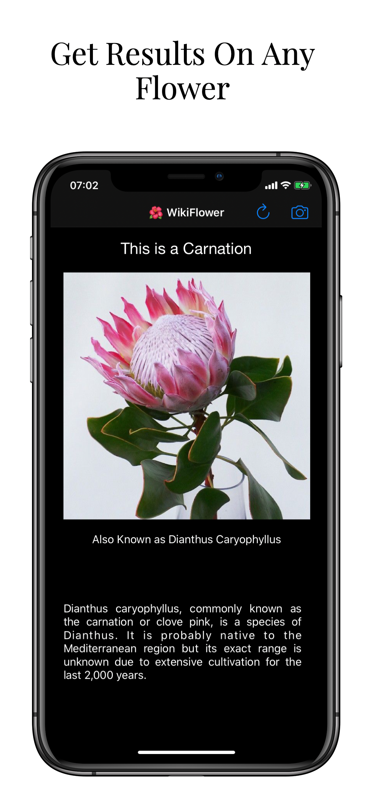

# WikiFlower - CoreML

A flower-recognition app on iOS using Machine Learning caffemodel from oxford named 'oxford102' to identify what type of flower the user wants to know about and retrieve details of the same flower through open api from wikipedia.org using Alamofire.

Does not contain CoreML Model file as it is too large

# Technologies used
- Xcode
- Swift
- CoreML
- Vision
- Networking
- JSON Parsing
- JSON Decoding
- Alamofire
- Storyboards and progmattic UI
- UIKit
- AutoLayout
- UIImagePickerController
- Cocoapods

# Screenshots

